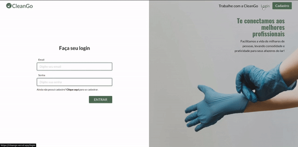

<p align="center">
  
</p>
<br>
<hr>
<br>

<h2 align="center">
  Projeto: CleanGo
</h2>
<br>

<blockquote align="center">"Num mundo em constante mudança, a única garantia para não falharmos, é não corrermos riscos.”

(Mark Zuckerberg)</blockquote>
<br>

<p align="center">

  <a href="LICENSE">
    
  </a>
  <a href="NPM">
    
  </a>
  <a href="GitHub followers">
    
  </a>
</p>
<hr>
<br>
<br>

# :rocket: Sobre o projeto

Com o objetivo de conectar profissionais autônomos de limpeza com pessoas que desejam contratar estes serviços de forma simplificada, ágil e com segurança, nasce a CleanGo, uma plataforma que pretende desburocratizar este processo.

Desenvolvido em equipe, dentro do curso da Kenzie Academy Brasil, com este projeto pude desenvolver tanto minhas hard skills, aprendendo mais sobre o uso do Typescript, autenticação com JWT, animações com GSAP e o próprio React, mas também foi uma grande oportunidade de desenvolver minhas soft skills, realizando o papel de Tech Lead da equipe.

**O CleanGo é um projeto realizado dentro do curso de desenvolvimento full-stack da Kenzie Academy Brasil.**

<br>

## :computer: Tecnologias utilizadas

A seguinte stack foi utilizada na construção do projeto:

- ReactJS
- TypeScript
- GreenSock
- Yup
- Axios
- JWT
- Styled-components
- JSON-Server

<br>

## :construction_worker: Instalação

**Primeiramente você precisa ter instalado o [Node.js](https://nodejs.org/en/download/), depois efetuar o clone deste repositório a partir do seguinte comando:**

```
git clone https://github.com/BrunoBelarminoNog/cleanGo.git
```

URLs SSH fornecem acesso a um repositório Git via SSH, um protocolo seguro. Se você tiver uma chave SSH registrada em
sua conta do Github, clone o projeto usando este comando:

```
git clone git@github.com:BrunoBelarminoNog/cleanGo.git
```

**Instale as dependências**

```
yarn || npm install
```

**Inicie o servidor**

```
yarn start || npm start
```

<br>

# :art: Layout

<br />
<p align="center">
  

</p>
<p align="center">
  
</p>
<br />

# :pushpin: Contribuindo

Sinta-se à vontade para registrar um novo problema com o respectivo título e descrição no repositório Torneio TriBruxo . Se você já encontrou uma solução para o problema, eu adoraria revisar sua solicitação de pull!

Verifique a página de contribuição para ver os melhores lugares para registrar problemas, iniciar discussões e começar a contribuir.

# :unlock: Licença

Lançado em 2021. Este projeto está sob a licença do MIT .

Feito com muita dedicação por Bruno Belarmino :zap:

Me siga nas redes! [LinkdIn](https://www.linkedin.com/in/bruno-belarmino-nog/)
